# ☱Documentação Prática

------
# ☱Topologia
------

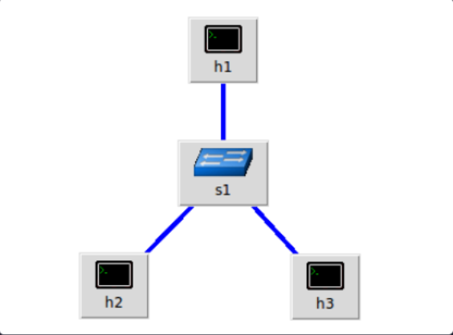

  

- Contém **um** **Switch v1Switch** - s1

- Contém **3 hosts** - h1, h2, h3
# ☱**Arquitetura PISA (Protocol Independent Switch Network)** - Vista em [P4 Tutorial](https://youtu.be/pk_s53l6-Ec?si=KHPi3Sulios9Jfps)
------

- Para a criação do código, seguimos a arquitetura PISA, implementando o funcionamento do parser, o conjunto de ação correspondência programável e o deparser ////no final
- Para o **parser**, ele analisa o pacote e o separa em headers individuais, no nosso caso, separamos em tipo ethernet e analisamos se é IPV4 ou não. Depois, analisamos se é TCP e seguimos o fluxo do pacote. Separando então nesses 3 headers
- Já para o **conjunto ação-correspondência** ele verifica o caso de o host que manda sua requisição já está bloqueado por algum motivo ou não (se tiver, dropa todos seus pacotes)
- Caso não esteja bloqueado, ele contabiliza o número de requisições SYN por host e (se o bloqueador de scan estiver ligado) bloqueia o host que enviou mais do que o número permitido previamente (ou permanentemente ou até o tempo informado acabar)
- E por fim, o **deparser** faz o inverso do parser, remontando o pacote de saída emitindo os headers na ordem (eth->IPv4->TCP) só emitindo os headers válidos
# ☱Arquitetura da solução
------

- Para a parte de captura de intenção da IBN, optamos por uma abordagem simples, que encontramos no [P4I/O: Intent-Based Networking with P4](https://research.tudelft.nl/en/publications/p4io-intent-based-networking-with-p4/) e em um listener feito pelo [Riftadi](https://github.com/riftadi/p4io/blob/master/src/intent_listener.py).
- Criamos a partir do esqueleto de código, o listener.py, que é um controlador de interação entre o que o operador pede e a lógica da rede, fazendo a ponte entre ele e os registradores/tabelas do switch programável p4. Seguindo o ciclo de uma IBN: captar intenção -> traduzir para o programa p4 -> aplicar no dispositivo -> assurance
	- Para captação de intenção, usamos regex para interpretar frases que nem "desbloquear h1 por n minutos", "bloquear todos os IPs maliciosos", transformando a frase em um dict Python com base em um dicionario criado previamente.
	- Na etapa de tradução, cada intenção vira um ou mais comandos enviados pro switch pelo **simple_switch_CLI**
		- Liga ou desliga o detector automático de scan
		- Bloqueia ou desbloqueia um ip pela tabela de controle de acesso (ACL)
	- Ele sempre calcula o mesmo registrador de cada host dentro do .p4 com hash, pra sempre acessar o slot correto em referencia ao host
		- Quando a intenção de bloqueio manual de host tem um tempo dito pelo operador, é o próprio controlador que agenda a liberação do IP; já no bloqueio automático do detector de scan, é o próprio switch que verifica pelos registradores `duracao` e `bloqueado_em` se o prazo já passou e libera o host sozinho (a nao ser que eu peça para que se bloqueie automaticamente algo por um determinado período)
	- Pra parte de assurance, o controlador consulta os registradores e a tabela do switch e aí mostra ao operador o estado real da rede, se o detector está ativo, quantos SYNs cada host enviou, quais hosts foram bloqueados e quais regras estão implementadas.

# ☱Detecção de scan
---

Para cada pacote **TCP SYN** (sem **ACK** - half-open scan), o switch calcula `idx = crc32(srcAddr) % 1024` e incrementa `syn_count[idx]` dentro de 10s.
Caso o contador passar do **limite** configurado, o IP é marcado em `bloqueado[idx]` e passa a ter todos seus pacotes dropados.
Se um prazo (`duracao`) for definido, é o próprio switch que verifica pelos registradores `duracao` e `bloqueado_em` se o tempo já passou e libera o host sozinho

# ☱Extra pra apresentação
------

- **Ideia tirada do [basic tunnel](https://github.com/p4lang/tutorials/tree/master/exercises/basic_tunnel)**
- Criamos o receive.py, que é um script que vai rodar no host receptor e vai ficar em estado de sniffing, captando todo o tráfego TCP da interface (mostra a flag de cada pacote; durante o scan, o que aparece é majoritariamente **SYN**, porque o nmap não completa o handshake)
- Fizemos isso apenas para tornar a explicação mais visual dentro do tempo de apresentação

# ☱Fotos do funcionamento do projeto

------

1. 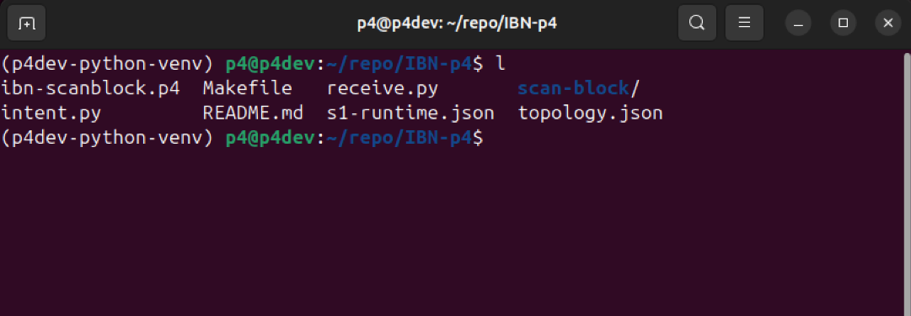
   *Pasta de arquivos*

2. 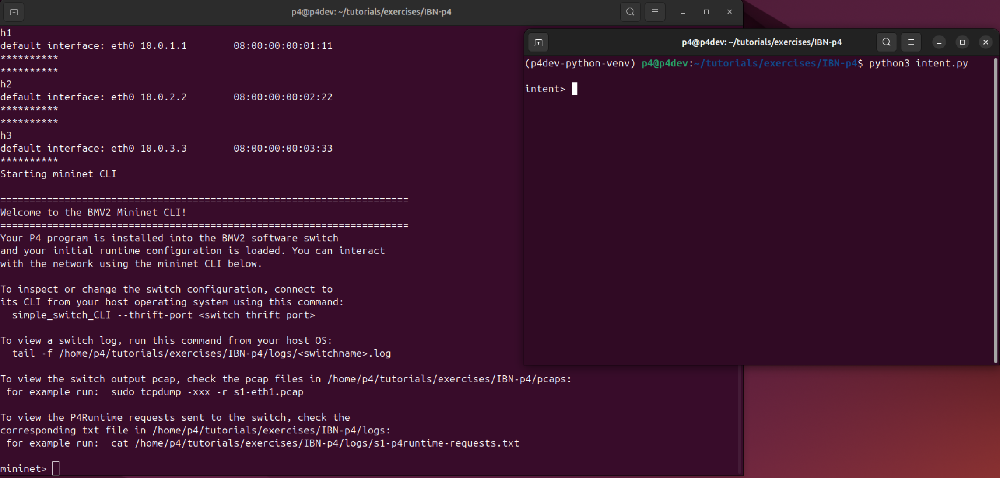
   *`make run` sobe a topologia e `intent.py` é iniciado*

3. 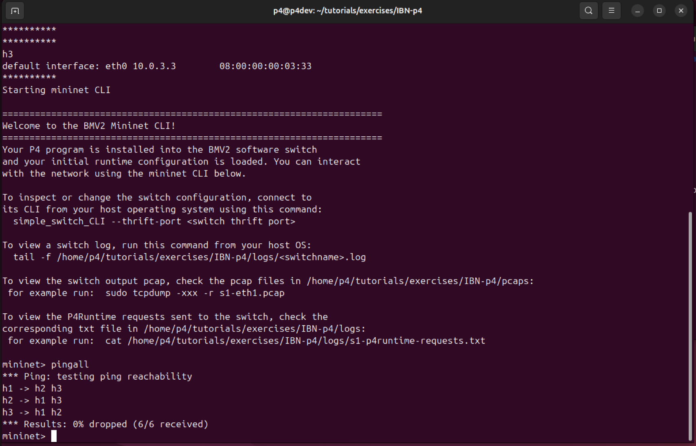
   *`pingall` confirma que a topologia e o encaminhamento L3 do switch estão funcionando*

4. 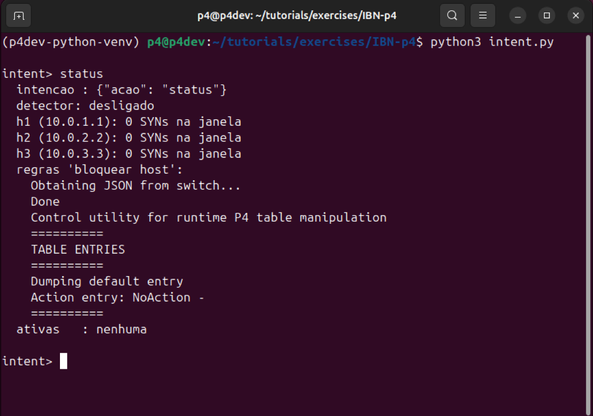
   *`status` inicial: detector desligado, nenhum host bloqueado e nenhuma intenção ativa*

5. 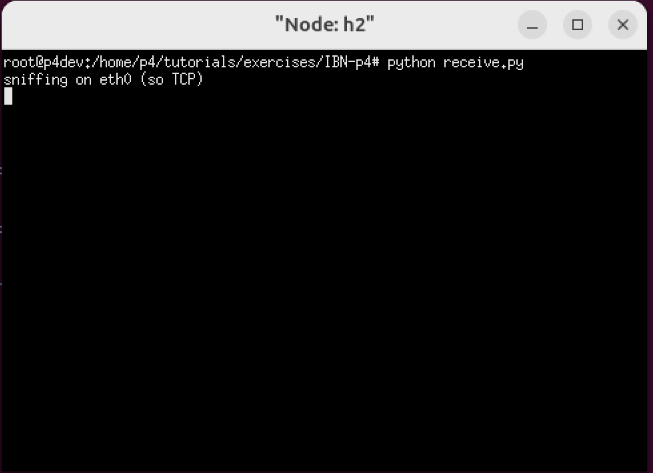
   *`receive.py` rodando em h2, só de olho no tráfego TCP (nenhum pacote foi enviado ainda)*

6. 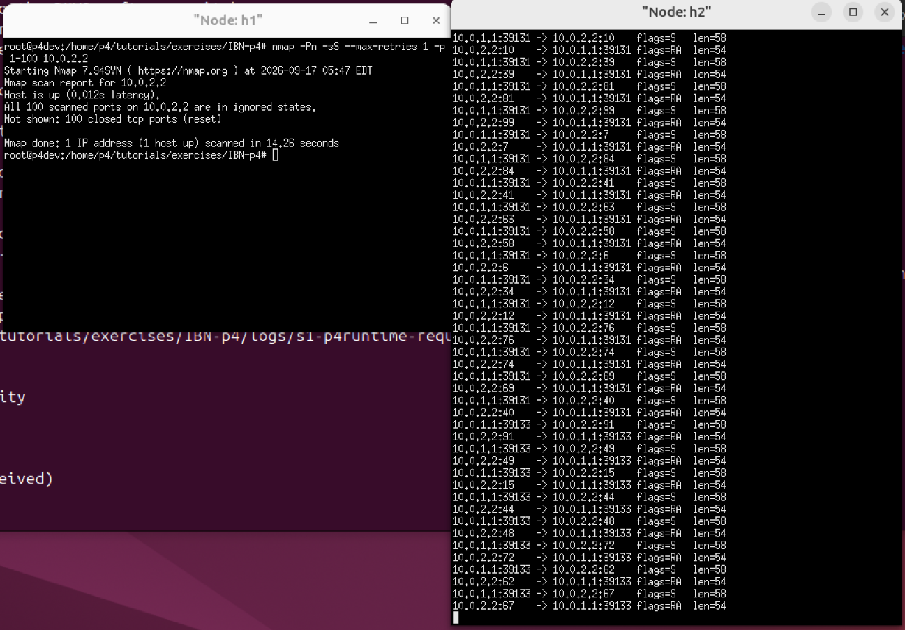
   *h1 faz um SYN scan (half-open, `nmap -sS`) em h2; em h2, o `receive.py` mostra os SYNs chegando e os SYN-ACK/RST, porta por porta*

7. 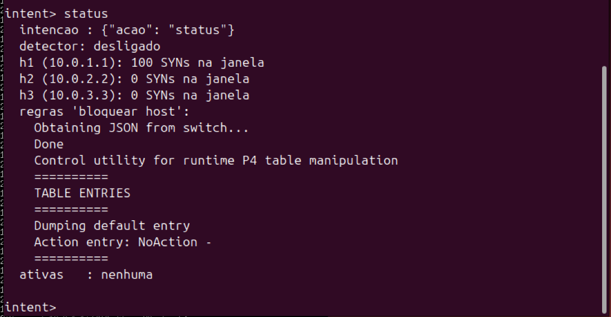
   *Depois do scan completo, o `status` mostra que o switch já somou ao contador os 100 SYNs de h1 na janela*

8. 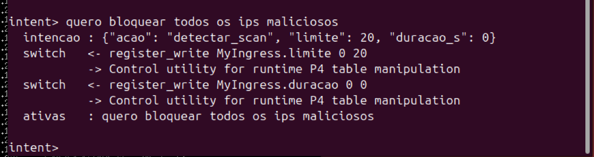
   *A intenção "bloquear todos os ips maliciosos" liga o detector automático: o controlador escreve o limite de 20 SYNs(padrão) e a duração (0 = bloqueio I N D E F I N I D O) direto nos registradores do switch*

9. 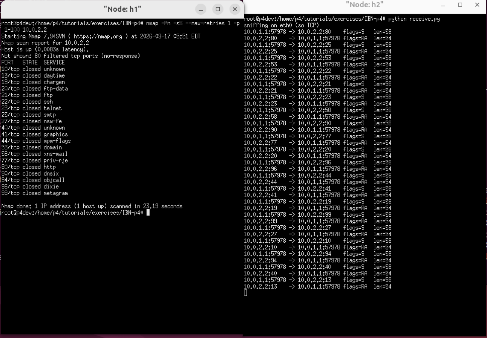
   *Com o detector automático ativo, o nmap só recebe resposta nas primeiras 20 portas (como foi definido antes) , o switch começa a dropar tudo dele, e o resto das portas dão como "no-response"*

10. 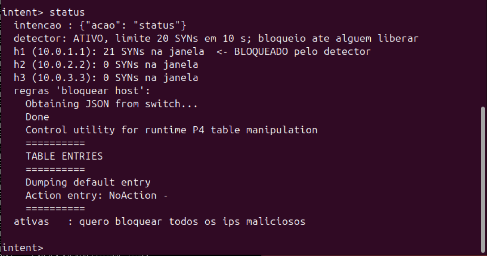
    *O `status` confirma que h1 ultrapassou os 20 SYNs permitidos e foi automaticamente marcado como BLOQUEADO pelo detector*

11. 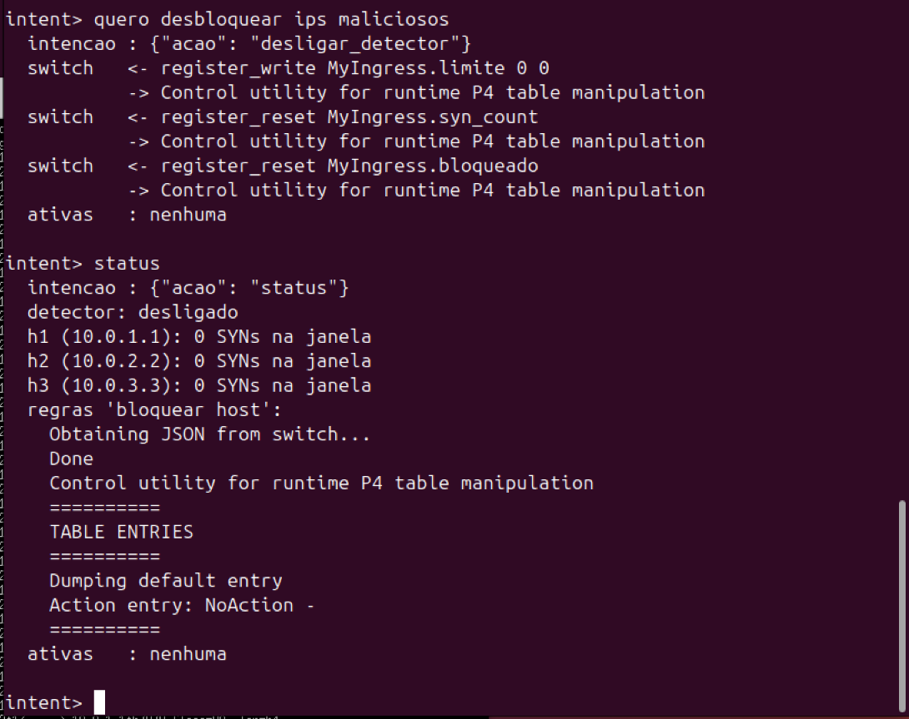
    *A intenção "desbloquear ips maliciosos" desliga o detector automático e zera os registradores de contagem e bloqueio. h1 pode praticar o mal novamente*

12. 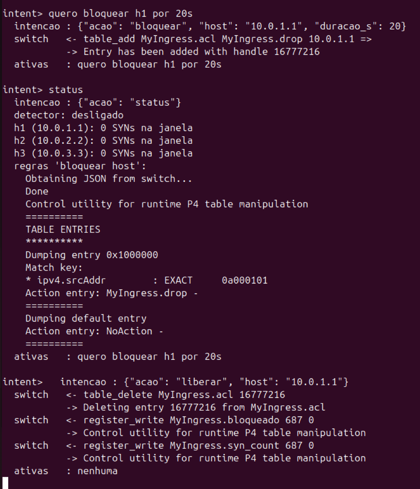
    *Ao pedir "bloquear h1 por 20 segundos", o controlador agenda a liberação, passados os 20s, é o `threading.Timer` do próprio `intent.py` que manda o comando `liberar` sozinho, sem o operador precisar pedir de novo (esse é o caso do bloqueio feito manualmente — diferente do detector automático, nesse caso quem controla o tempo é o controlador, não o switch).*